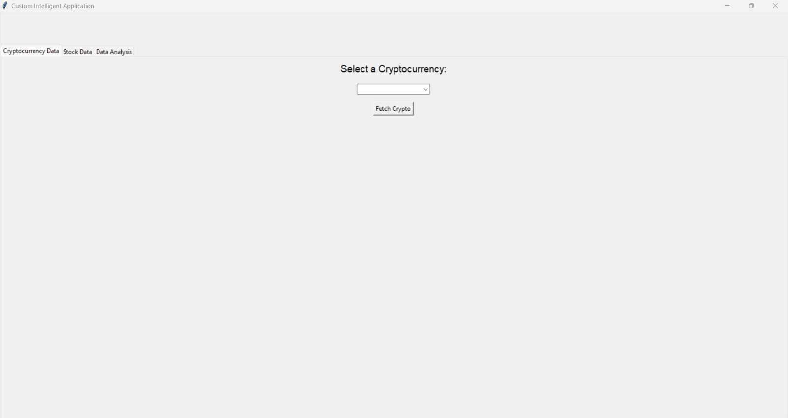
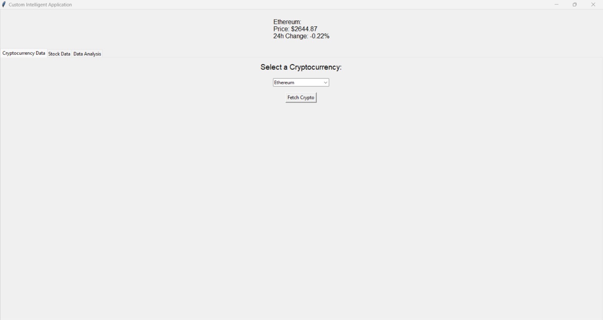
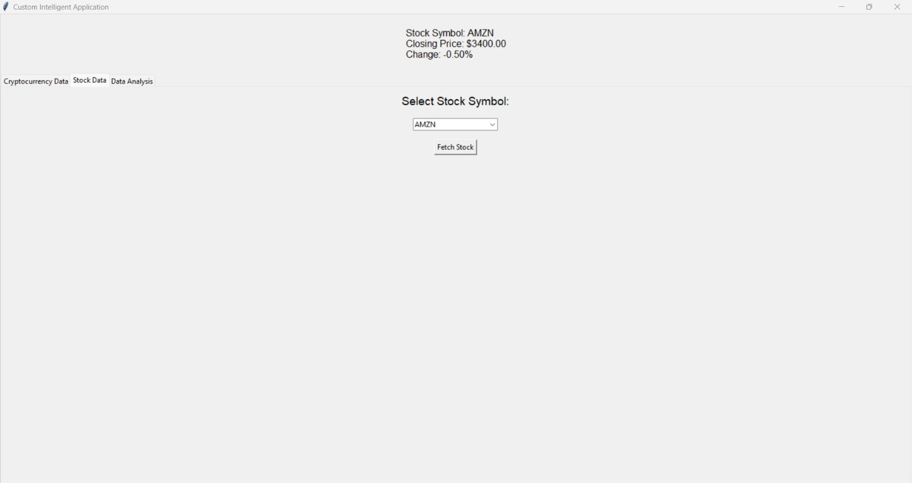
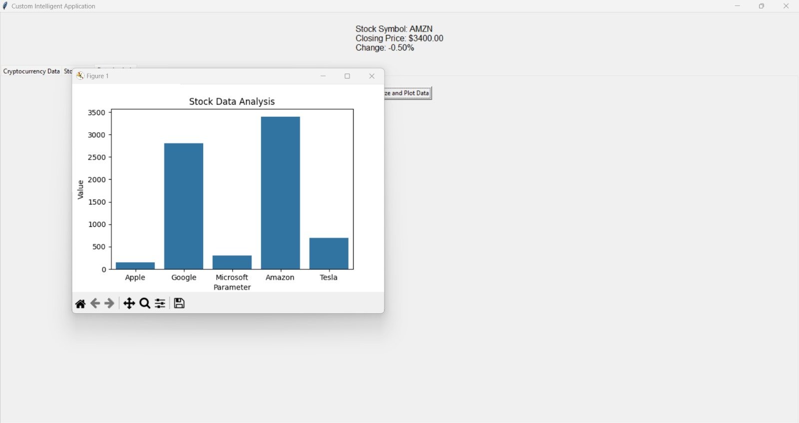

# Custom Intelligent Application

This project is a Python-based GUI application that allows users to:

1. Fetch cryptocurrency data from the CoinGecko API.
2. Display stock data for selected stocks.
3. Analyze and visualize stock data with simple plots.

The application is built using the following technologies:
- **Tkinter**: For the graphical user interface (GUI).
- **Requests**: To make HTTP requests to the CoinGecko API.
- **Pandas**: For data manipulation and management.
- **Matplotlib & Seaborn**: For data visualization and analysis.
- **Threading**: To keep the GUI responsive when fetching data from APIs.

## Features

### Cryptocurrency Data
- Users can select a cryptocurrency from a dropdown list (e.g., Bitcoin, Ethereum).
- The app fetches the current price and the 24-hour price change from the CoinGecko API.
- The data is displayed on the screen for the selected cryptocurrency.

### Stock Data
- Users can select a stock symbol (e.g., AAPL, GOOGL, MSFT, AMZN, TSLA).
- Static data for the selected stock, including the closing price and percentage change, is displayed on the screen.

### Data Analysis
- Users can perform basic stock data analysis.
- A bar plot is generated showing stock data for companies like Apple, Google, Microsoft, Amazon, and Tesla.

## Features
- Fetches real-time cryptocurrency data from the **CoinGecko API**.
- User-friendly GUI built using **Tkinter** with tabbed navigation.
- Includes basic data analysis and plotting functionalities.
- Displays cryptocurrency prices and 24-hour percentage changes.
- Visualizes predefined cryptocurrency data through a bar chart.

## Project Structure
- `main.py`: The main application file containing the GUI and logic.
- `data_fetch.py`: Handles cryptocurrency data retrieval from the CoinGecko API.
- `data_analysis.py`: Contains data analysis and visualization logic.
  
## Requirements
This project requires Python 3.x and the following Python libraries:
- `requests`: To handle API requests and retrieve cryptocurrency data.
- `pandas`: For handling and processing data.
- `matplotlib`: For data visualization (charts, plots).
- `seaborn`: For enhanced visualization styles (based on matplotlib).
- `tkinter`: The default Python library for GUI development.

## Setup

### Prerequisites
Make sure you have the following installed:
- **Python 3.x**
- **pip** (Python package manager)

### Installation

1. Clone the repository:
   ```bash
   git clone https://github.com/dgutta1409/CST_Project.git
   ```

2. Navigate to the project directory:
   ```bash
   cd CST_Project
   ```

3. Install the required packages:
   ```bash
   pip install -r requirements.txt
   ```

### Required Libraries
You can also install the required packages manually:
```bash
pip install requests pandas matplotlib seaborn
```

### Running the Application

To run the application, execute the following command in the terminal or command prompt:

```bash
python GUI_Application.py
```

This will launch the GUI, where you can interact with the application to fetch cryptocurrency and stock data or perform data analysis.

## Usage Guide

### GUI Tabs:
1. **Cryptocurrency Data**
   - Choose a cryptocurrency from the dropdown list (e.g., Bitcoin, Ethereum, Ripple).
   - Click on "Fetch Crypto" to retrieve the latest price and 24-hour price change.

2. **Data Analysis**
   - Click "Analyze and Plot Data" to generate a bar chart displaying predefined data on cryptocurrency prices and 24-hour changes.

### Modules Overview

**main.py**
- **Functionality:** Sets up the application's graphical user interface (GUI) using Tkinter.
- Integrates with `data_fetch.py` to fetch and display real-time data.
- Utilizes `data_analysis.py` for basic data analysis and visualization.

**data_fetch.py**
- **Functionality:** Fetches current cryptocurrency data from the CoinGecko API.
- Includes error handling for failed requests or unexpected data.

**data_analysis.py**
- **Functionality:** Leverages Pandas and Seaborn to analyze predefined cryptocurrency data.
- Plots a bar chart to visualize prices and percentage changes.

## Screenshots
### Main Interface

### Cryptocurrency Data Fetched

### Stock Data Fetched

### Data Analysis Visualization



## API Information

This application uses the **CoinGecko API** to fetch real-time cryptocurrency data. You do not need an API key to access this data.

- API Documentation: [CoinGecko API](https://www.coingecko.com/en/api)

## Future Enhancements

Some potential improvements that can be added to the application:
- Integration with live stock data API (e.g., Alpha Vantage, Yahoo Finance API).
- More advanced data analysis features, such as historical price charts.
- Add more cryptocurrencies and stock symbols to the dropdown menus.
- Enhance the UI with more customization options.
